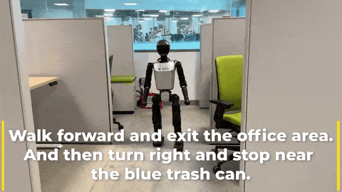
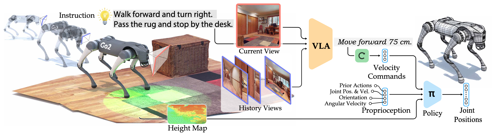
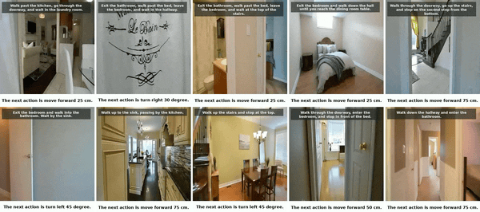
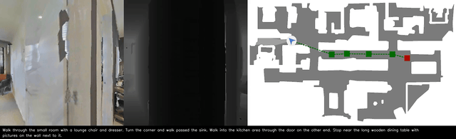

<div align="center">

<p align="center">
  
</p>

# NaVILA: Legged Robot Vision-Language-Action Model for Navigation (RSS'25)

[](https://navila-bot.github.io/)
[](https://arxiv.org/abs/2412.04453)
[](https://huggingface.co/collections/a8cheng/navila-legged-robot-vision-language-action-model-for-naviga-67cfc82b83017babdcefd4ad)
[](https://github.com/yang-zj1026/legged-loco)

 
<p align="center">
  
</p>

</div>

## 💡 Introduction

NaVILA is a two-level framework that combines VLAs with locomotion skills for navigation. It generates high-level language-based commands, while a real-time locomotion policy ensures obstacle avoidance.

<p align="center">
  
</p>


## TODO
- [x] Release mode/weight/evaluation.
- [x] Release training code. (around June 30th)
- [x] Release YouTube Human Touring dataset. (around June 30th)
- [x] Release Isaac Sim evaluation, please see [here](https://github.com/yang-zj1026/NaVILA-Bench).

## 🚀 Training
### Installation
To build environment for training NaVILA, please run the following:
```bash
./environment_setup.sh navila
conda activate navila
```
Optional: If you plan to use TensorBoard for logging, install `tensorboardX` via pip.

### Dataset
For general VQA datasets like `video_chatgpt`, `sharegpt_video`, `sharegpt4v_sft`, please follow the data preparation instructions in [NVILA](https://github.com/NVlabs/VILA).
We provide annotations for `envdrop`, `scanqa`, `r2r`, `rxr`, and `human` on [Hugging Face](https://huggingface.co/datasets/a8cheng/NaVILA-Dataset).
Please download the repo and extract the `tar.gz` files in their respective subfolders. 
<p align="center">

</p>

* **YouTube Human Touring:**  
Due to copyright restrictions, raw videos/images are not released. We provide **[video IDs](https://huggingface.co/datasets/a8cheng/NaVILA-Dataset/blob/main/Human/video_ids.txt)** and **annotations**. You can download the videos using `yt-dlp` and extract frames using: `scripts/extract_rawframes.py`

* **EnvDrop:**  
Due to the large number of videos, we provide **annotations only**. Please download the **R2R augmented split** from [R2R_VLNCE_v1-3_preprocessed.zip](https://drive.google.com/file/d/1fo8F4NKgZDH-bPSdVU3cONAkt5EW-tyr/view?usp=sharing) and render corresponding videos using [VLN-CE](https://github.com/jacobkrantz/VLN-CE).

The data should have structure like:
```graphql
NaVILA-Dataset
├─ EnvDrop
|   ├─ videos
|   |    ├─ 1.mp4
|   |    ├─ ...
|   ├─ annotations.json
├─ Human
|   ├─ raw_frames
|   |    ├─ Aei0GpsWNys
|   |    |    ├─ 0001.jpg
|   |    |    ├─ ...
|   |    ├─ ...
|   ├─ videos
|   |    ├─ Aei0GpsWNys.mp4
|   |    ├─ ...
|   ├─ annotations.json
|   ├─ video_ids.txt
├─ R2R
|   ├─ train
|   |    ├─ 1
|   |    |    ├─ frame_0.jpg 
|   |    |    ├─ ...
|   |    ├─ ...
|   ├─ annotations.json
├─ RxR
|   ├─ train
|   |    ├─ 1
|   |    |    ├─ frame_0.jpg 
|   |    |    ├─ ...
|   |    ├─ ...
|   ├─ annotations.json
├─ ScanQA
|   ├─ videos
|   |    ├─ scene0760_00.mp4
|   |    ├─ ...
|   ├─ annotations
|   |    ├─ ScanQA_v1.0_train_reformat.json
|   |    ├─ ...
```


### Training
The pretrain model to start from is provided in [a8cheng/navila-siglip-llama3-8b-v1.5-pretrain](https://huggingface.co/a8cheng/navila-siglip-llama3-8b-v1.5-pretrain). Please modify the data paths in `llava/data/datasets_mixture.py` and use the script in `scripts/train/sft_8frames.sh` to lanuch the training. 


## 📊 Evaluation

### Installation

This repository builds on [VLN-CE](https://github.com/jacobkrantz/VLN-CE), which relies on older versions of [Habitat-Lab](https://github.com/facebookresearch/habitat-lab/tree/v0.1.7) and [Habitat-Sim](https://github.com/facebookresearch/habitat-lab/tree/v0.1.7). The installation process requires several modifications and can be complex.

1. Create a Conda Environment with Python 3.10
```bash
conda create -n navila-eval python=3.10
conda activate navila-eval
```

2. Build Habitat-Sim & Lab (v0.1.7) from **Source**

Follow the [VLN-CE setup guide](https://github.com/jacobkrantz/VLN-CE?tab=readme-ov-file#setup).
To resolve NumPy compatibility issues, apply the following hotfix:
```bash
python evaluation/scripts/habitat_sim_autofix.py # replace habitat_sim/utils/common.py
```

3. Install VLN-CE Dependencies
```bash
pip install -r evaluation/requirements.txt
```

4. Install VILA Dependencies
```bash
# Install FlashAttention2
pip install https://github.com/Dao-AILab/flash-attention/releases/download/v2.5.8/flash_attn-2.5.8+cu122torch2.3cxx11abiFALSE-cp310-cp310-linux_x86_64.whl

# Install VILA (assum in root dir)
pip install -e .
pip install -e ".[train]"
pip install -e ".[eval]"

# Install HF's Transformers
pip install git+https://github.com/huggingface/transformers@v4.37.2
site_pkg_path=$(python -c 'import site; print(site.getsitepackages()[0])')
cp -rv ./llava/train/transformers_replace/* $site_pkg_path/transformers/
cp -rv ./llava/train/deepspeed_replace/* $site_pkg_path/deepspeed/
```

5. Fix WebDataset Version for VLN-CE Compatibility
```bash
pip install webdataset==0.1.103
```

### Data
Please follow [VLN-CE](https://github.com/jacobkrantz/VLN-CE) and download R2R and RxR annotations, and scene data inside the `evaluation/data` folder. The data should have structure like:
```graphql
data/datasets
├─ RxR_VLNCE_v0
|   ├─ train
|   |    ├─ train_guide.json.gz
|   |    ├─ ...
|   ├─ val_unseen
|   |    ├─ val_unseen_guide.json.gz
|   |    ├─ ...
|   ├─ ...
├─ R2R_VLNCE_v1-3_preprocessed
|   ├─ train
|   |    ├─ train.json.gz
|   |    ├─ ...
|   ├─ val_unseen
|   |    ├─ val_unseen.json.gz
|   |    ├─ ...
data/scene_datasets
├─ mp3d
|   ├─ 17DRP5sb8fy
|   |    ├─ 17DRP5sb8fy.glb
|   |    ├─ ...
|   ├─ ...
```
### Running Evaluation
1. Download the checkpoint from [a8cheng/navila-llama3-8b-8f](https://huggingface.co/a8cheng/navila-llama3-8b-8f).
2. Run evaluation on R2R using:
```bash
cd evaluation
bash scripts/eval/r2r.sh CKPT_PATH NUM_CHUNKS CHUNK_START_IDX "GPU_IDS"
```
Examples:
* Single GPU:
    ```bash
    bash scripts/eval/r2r.sh CKPT_PATH 1 0 "0"
    ```
* Multiple GPUs (e.g., 8 GPUs):
    ```bash
    bash scripts/eval/r2r.sh CKPT_PATH 8 0 "0,1,2,3,4,5,6,7"
    ```
3. Visualized videos are saved in 
```bash
./eval_out/CKPT_NAME/VLN-CE-v1/val_unseen/videos
```
<p align="center">
  
</p>
4. Aggregate results and view the scores

```bash
python scripts/eval_jsons.py ./eval_out/CKPT_NAME/VLN-CE-v1/val_unseen NUM_CHUNKS
```

_______________________________________________________________

## 📜 Citation

```bibtex
@inproceedings{cheng2025navila,
        title={Navila: Legged robot vision-language-action model for navigation},
        author={Cheng, An-Chieh and Ji, Yandong and Yang, Zhaojing and Gongye, Zaitian and Zou, Xueyan and Kautz, Jan and B{\i}y{\i}k, Erdem and Yin, Hongxu and Liu, Sifei and Wang, Xiaolong},
        booktitle={RSS},
        year={2025}
}
```
